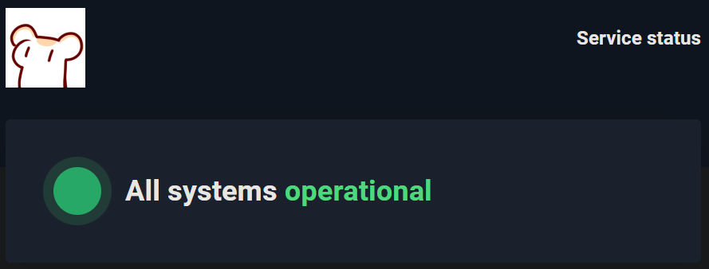

# hatsushimo 初霜

**hatsushimo** is the 4th generation of **Hamster** (仓鼠) the chatbot which is based on the [koishi](https://github.com/koishijs/koishi) bot framework, providing some useful commands for our guild which called **Eorzea Macrology Association** (艾欧泽亚宏学研讨会).

Currently **Hamster** (仓鼠) supports Discord and QQ, and we are working on other platforms.

The codename **hatsushimo** is a Japanese word (初霜) which means the "first frost in the year".

## Note

This repository is a workspace powered by lerna for developing the bot,
if you want to read the source code of plugins that are used in this bot,
please click those links below.

## Features and Plugins

### FFXIV-related

- [koishi-plugin-ffxiv-eorzea](https://www.npmjs.com/package/koishi-plugin-ffxiv-eorzea): Some useful commands for FFXIV players, such as item searching, Eorzea time, etc.
- [koishi-plugin-ffxiv-lodestone](https://www.npmjs.com/package/koishi-plugin-ffxiv-lodestone): Search FFXIV news from Lodestone.
- [koishi-plugin-ffxiv-macrodict](https://www.npmjs.com/package/koishi-plugin-ffxiv-macrodict): Search FFXIV macro (text command) dictionary in English/German/French/Japanese/Chinese/Korean.

### Misc

- [koishi-plugin-image-search](https://www.npmjs.com/package/koishi-plugin-image-search): Search image information by image.
- [koishi-plugin-hitokoto](https://www.npmjs.com/package/koishi-plugin-hitokoto): Random "hitokoto" sentences from [hitokoto.cn](https://hitokoto.cn).

## Status

[Hamster Status](https://stats.uptimerobot.com/Kknj0SDmMg) is a service status monitor for Hamster,
which is powered by [Uptime Robot](https://uptimerobot.com/).

## License

This project is licensed under the MIT license.

see [LICENSE](LICENSE) for more information.
